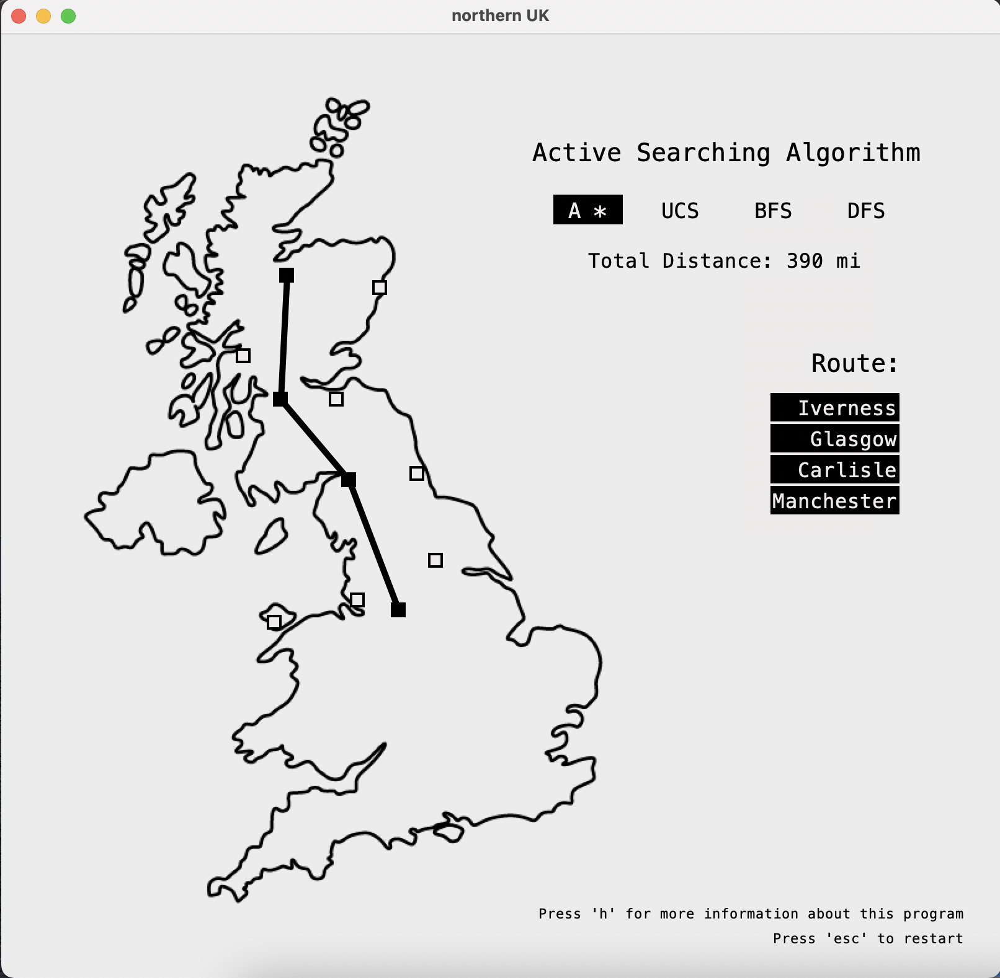

# Graph Searching Algorithms

### Interactive Navigation Program
'UK_Graph_Search.py' demonstrates the capability of several graph searching algorithms with an interactive navigation program. The program shows different routes you can take from one city in the North of the UK to another. The routes are calculated with the following graph searching algorithms.

You can see this program in action by downloading the files in this directory, and running 'UK_Graph_Search.py' with python3. 

### Algorithms
This folder holds my original implementations of depth first search, breadth first search, uniform cost search, and A-star. 

### Custom Data Type
Also included is my code for a singly linked list data type. This data type supports stack and queue functionality natively, and is essential to run the searching algorithms in this folder.