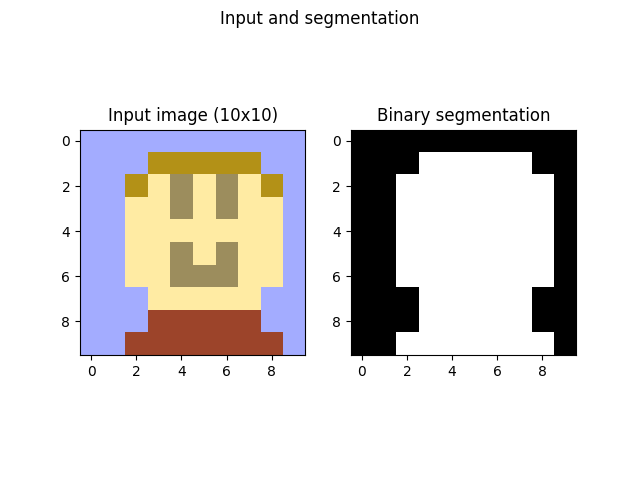

# Image Segmentation

### About
This is an image segmentation program that utilizes the network flow algorithm to divide and image into foreground and background. 

The network flow algorithm has many applications, and before the recent revolution in image processing made by convolutional neural networks, it was one of the dominant methods of pixel classification in images.

