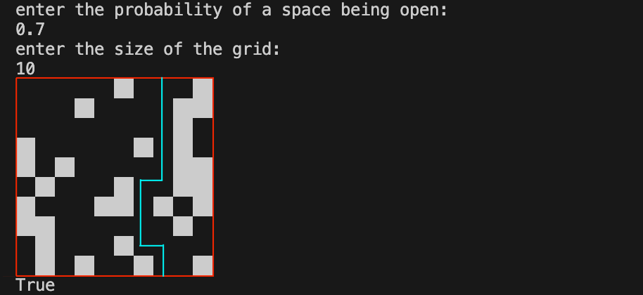

# Percolation.py
This is my implementation of a playground for the classic percolation problem. The challenge is to find out if given an arbitrary number of squares in an `N x N` grid and an arbitrary probability of each of those squares being permeable, will there be a path from the top of the grid to the bottom. In this example, we have a probability `0.7` for each square in the `10 x 10` grid to be permeable (or black), and we can see a path (light blue) from the top of the grid to the bottom. The program also outputs `True`, meaning such a path has been confirmed programatically. 

