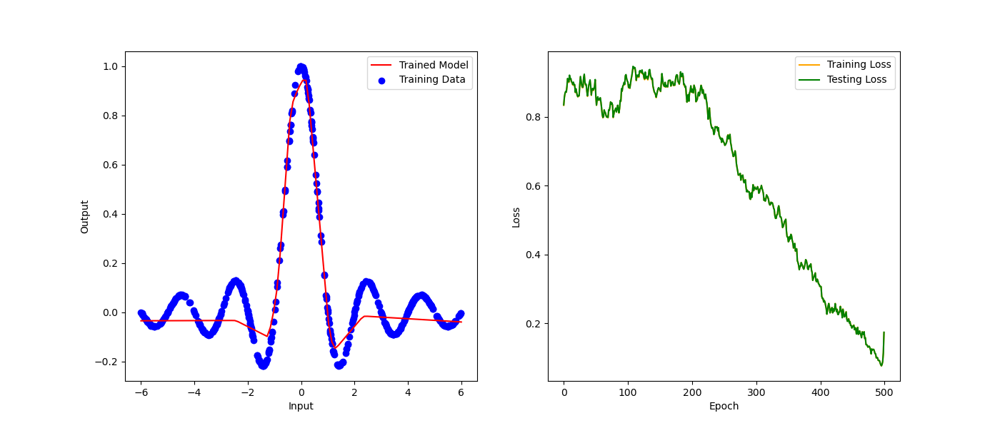

# GroundUpSGD.py
This is my ground-up implementation of Stochastic Gradient Decent for neural networks in Python using nothing but NumPy. The purpose of this project was to cement my understanding of the fundamentals of gradient decent, and how it's used in more expansive programs like PyTorch and TensorFlow. 

The left plot below shows a demonstration of the trainable neural network data type with one dimension of input and output data. The plot on the right shows the progression of the training through the epochs. 

The data type is set up for a two-layer (relatively shallow) neural network. This constraint could be lifted to allow for arbitrarily deep networks, but without precompiling the training methods, training such a model would be unreasonably slow. 