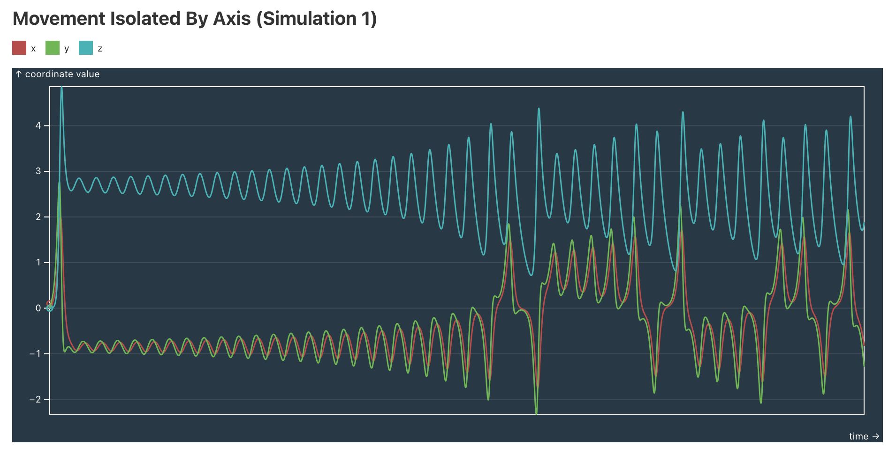

### The Project:
https://observablehq.com/d/cf706d85d6118bc3@53

The goal of this project was to help the viewer develop some intuition about the Lorenz System, as the high-dimensional nature of the system makes it hard to wrap your head around it when you are first introduced to it. A strong focus in this project was making the data visualization clear and accessible. The choice of color scheme was made to be color-blind friendly and visually appealing. Much of this project was aided by Gould's *An Introduction to Computer Simulation Methods*. 

The data is simulated using the user-selected values for initial conditions, the Lorenz Equations, and a JavaScript ODE integrator using the [fourth-order Runge-Kutta](https://en.wikipedia.org/wiki/Runge%E2%80%93Kutta_methods) method. I used NumJS to make the integrator in JavaScript, which is the `run_simulation` function in lib.js. I utilized a JavaScript library called THREE, as well as D3, to create the 3D display. The static view was done using Observable Plot and D3.

The most significant liberty I took in this project was mirroring the two simulations about the z axis in the animated view. This allows one to view two simulations with two separate initial conditions side-by-side, as in the stable state set by default, the Lorenz Attractors appear entirely in the positive z domain. In effect, the horizontal axes can be thought of as: \[+x, +z, -x, +z]. 

### Dynamic View

### Static View

### The Lorenz System
The [Lorenz System](https://en.wikipedia.org/wiki/Lorenz_system) is a system of ODEs that is defined as follows:

x' = σ(y - x)

y' = x(r - z) - y

z' = xy - bz

This system is very sensitive to initial conditions, but with some specific choices of σ, b, and r, one can observe some very interesting stable scenarios. For example σ = 10, b = 8/3, and r = 28 produces the characteristic Lorenz attractors irrespective of the initial spacial conditions. There is no analytical solution for the Lorenz system, so we use numerical methods to simulate the system with different initial conditions.

# Running this Notebook

View this notebook in your browser by running a web server in this folder. For
example:

~~~sh
npx http-server
~~~

Or, use the [Observable Runtime](https://github.com/observablehq/runtime) to
import this module directly into your application. To npm install:

~~~sh
npm install @observablehq/runtime@5
npm install https://api.observablehq.com/d/cf706d85d6118bc3@53.tgz?v=3
~~~

Then, import your notebook and the runtime as:

~~~js
import {Runtime, Inspector} from "@observablehq/runtime";
import define from "cf706d85d6118bc3";
~~~

To log the value of the cell named “foo”:

~~~js
const runtime = new Runtime();
const main = runtime.module(define);
main.value("foo").then(value => console.log(value));
~~~
